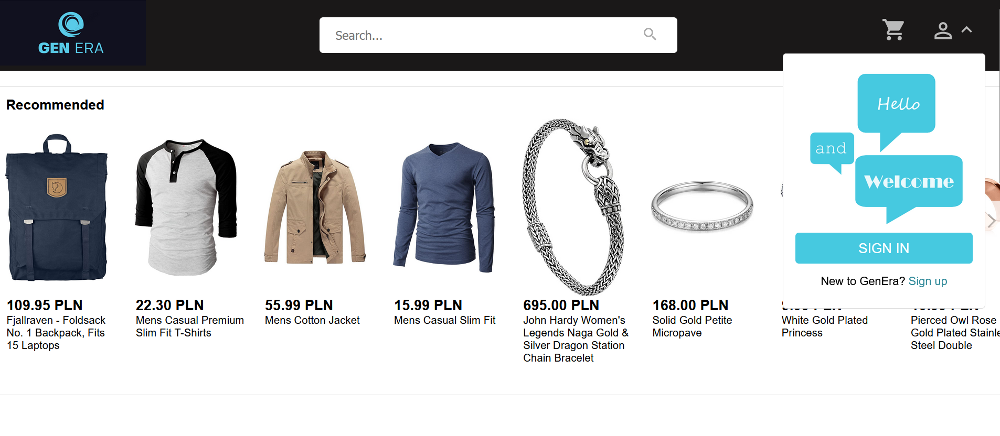
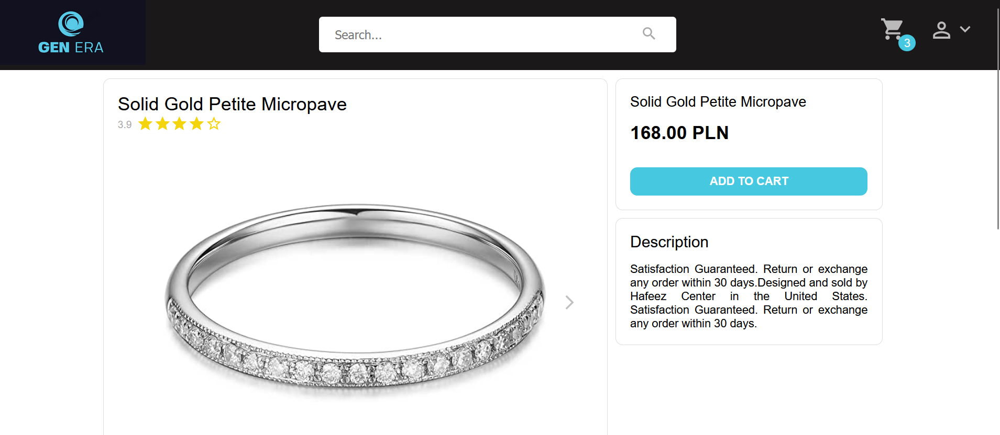
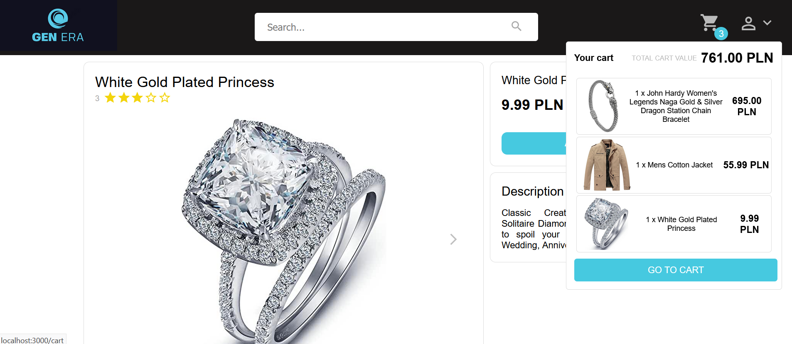
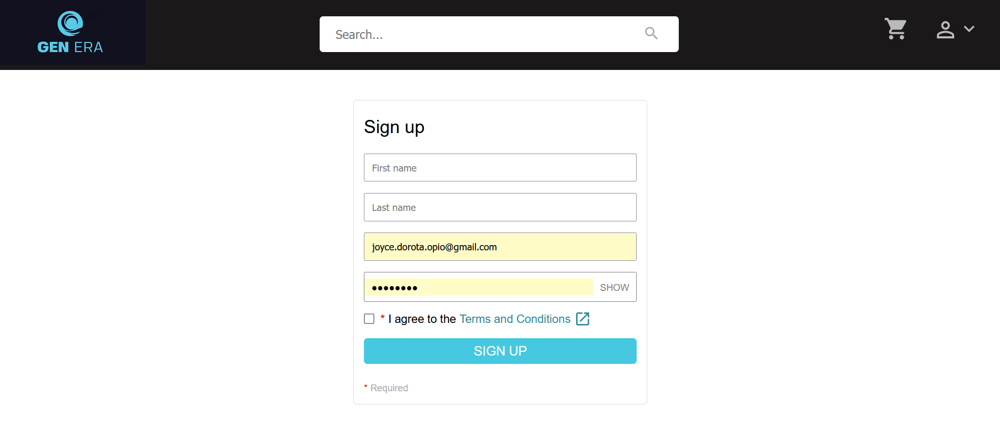
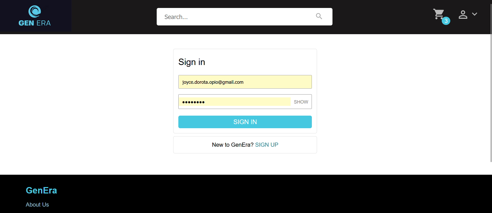
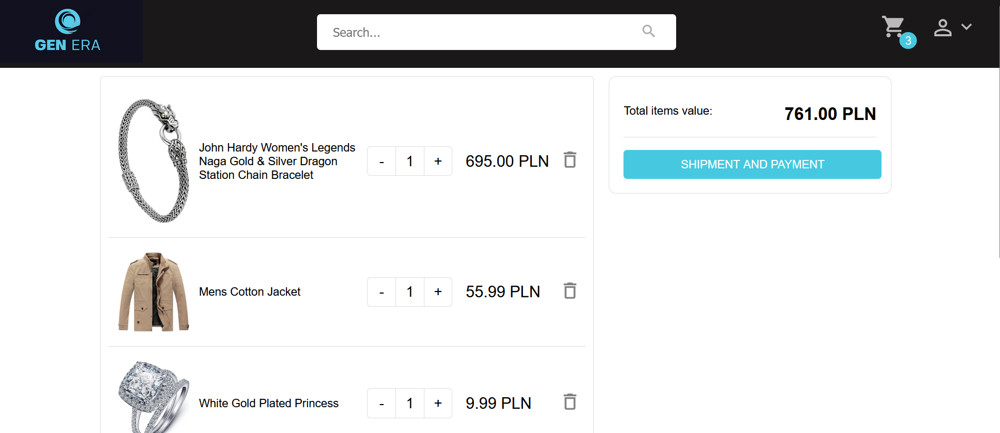

# e-commerce-frontend

This project is the frontend side to the e-commerce portfolio project. It showcases a basic website which allows the user to view and search products available for purchase.

<br>

### Home view



<br>

### Search view (top)

")

")

<br>

### Product view





<br>

### Sign Up view



<br>

### Sign In view



<br>

### Cart view



The project uses fake data which includes some duplicates in it.

## Available Scripts

In the project directory, you can run:

```
npm run dev
```

Runs the app in the development mode.\
Open [http://localhost:5173](http://localhost:5173) to view it in your browser.

The page will reload when you make changes.\
You may also see any lint errors in the console.

## Technologies used

- React
- TypeScript
- Vite
